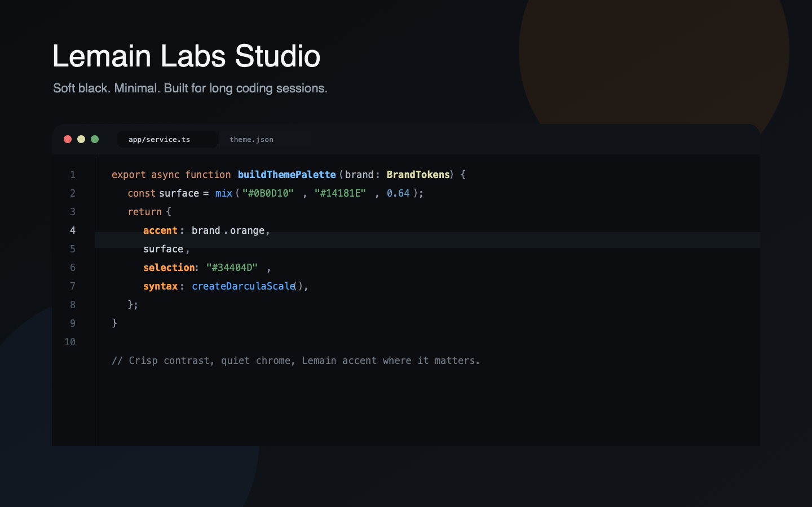
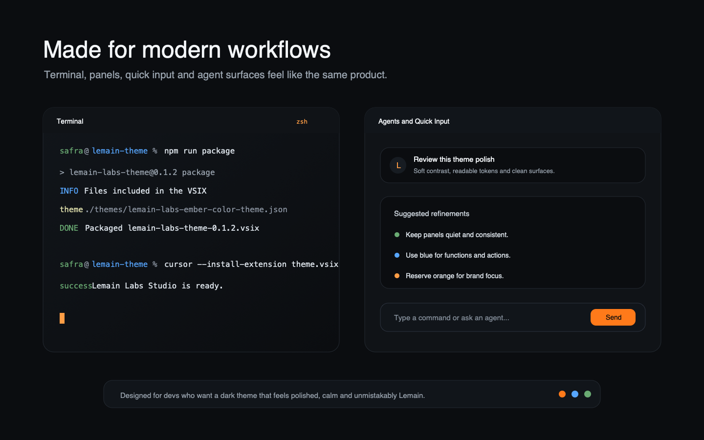

# Lemain Labs Theme

Soft black theme for VS Code and Cursor, designed for developers who want something cleaner than generic dark themes and more restrained than neon palettes.

`Lemain Labs Studio` combines Android Studio/Darcula-style readability with the Lemain Labs orange accent. The result is dark, minimal and comfortable for long sessions.



## Why Install

- Soft black surfaces reduce visual fatigue without turning the editor flat.
- Syntax colors are balanced for real code: blue functions, green strings, soft yellow types, dry orange keywords and calm gray variables.
- Lemain orange is reserved for focus, activity, actions and important keys.
- Cursor panels, sidebars, quick input and agent-adjacent surfaces keep the same visual rhythm.
- Works well across JavaScript, TypeScript, JSX/TSX, Java, PHP, C, C++, Go, Python, JSON, CSS/SCSS and Markdown.

## Terminal and Agents

The UI avoids noisy borders and heavy highlights. Terminal colors, quick input, panels and Cursor surfaces use the same palette, so the theme feels cohesive when switching between coding, running commands and working with agents.



## Palette

- Background: `#0B0D10`
- Surface: `#101317`
- Elevated surface: `#14181E`
- Border: `#242A32`
- Text: `#DCE3EA`
- Soft text: `#9AA4AF`
- Muted text: `#6B737D`
- Accent: `#FF7A1A`
- Soft accent: `#FF9D45`
- Selection: `#34404D`

## Recommended Editor Feel

The theme controls colors, contrast and visual states. Spacing, line height and padding are editor settings. This setup pairs well with the theme:

```json
{
  "editor.fontSize": 14,
  "editor.lineHeight": 23,
  "editor.letterSpacing": 0.15,
  "editor.padding.top": 8,
  "editor.padding.bottom": 8,
  "editor.renderWhitespace": "selection",
  "editor.cursorSmoothCaretAnimation": "on",
  "editor.guides.bracketPairs": "active",
  "editor.bracketPairColorization.enabled": true,
  "workbench.tree.indent": 14,
  "explorer.compactFolders": false
}
```

## Install Locally

```sh
npm install
npm run package
```

Then install the generated `.vsix`:

```sh
cursor --install-extension lemain-labs-theme-1.0.0.vsix
```

Select `Lemain Labs Studio` from `Preferences: Color Theme`.

## Development

Open this repository in VS Code or Cursor and press `F5` to launch an Extension Development Host.

## Publishing

```sh
npm run publish
```

Before publishing, confirm the `publisher` in `package.json` matches the real Marketplace publisher.
